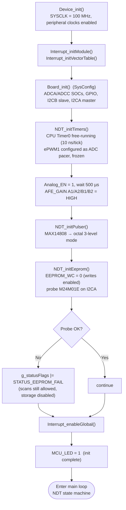
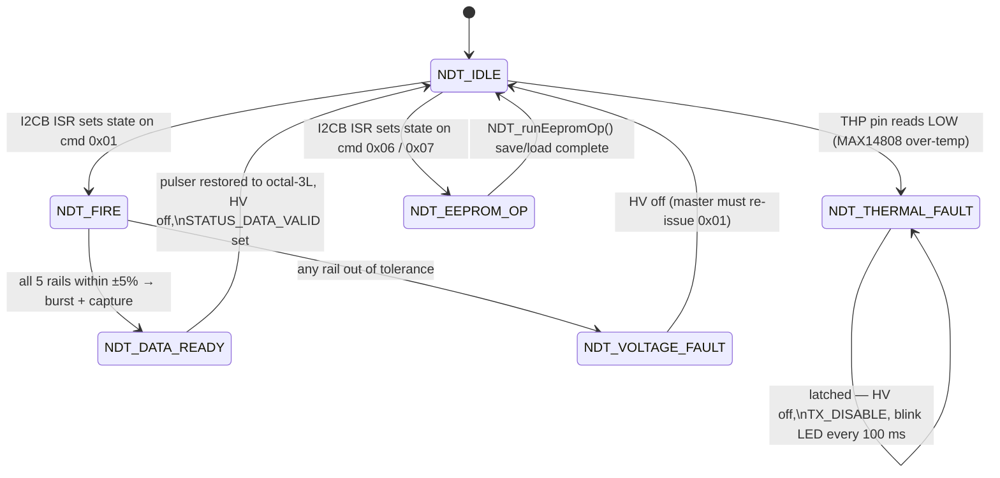
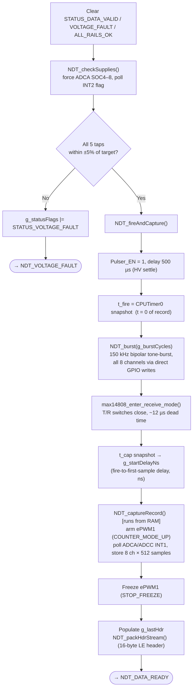
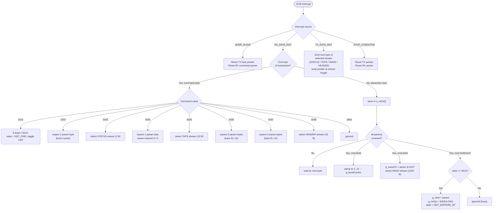

# F280025 NDT Auxiliary Board — Firmware Flowcharts

(150 kHz guided-wave collar: tone-burst A-scan + EEPROM storage).

---

## 1. Boot / Initialization Sequence (`main()`, steps 1–8)

---

## 2. Main Loop — NDT State Machine

---

## 3. `NDT_FIRE` → `NDT_fireAndCapture()` Detail

---

## 4. I2CB Slave ISR — Command / Stream Dispatch

---

## Reference — I2CB Command Table

| Write bytes | Effect | Read-back |
|---|---|---|
| `0x01` | Trigger A-scan (rails checked first) | — |
| `0x02 [n]` | Set burst cycles, clamped 5–10 | — |
| `0x03` | Select STATUS stream | 2 bytes |
| `0x04 [ch]` | Select WAVEFORM stream, channel 0–7 | 1024 bytes (512× uint16 LE) |
| `0x05` | Select TAPS stream | 10 bytes |
| `0x06 [idL][idH]` | Save current A-scan to EEPROM under ID | — |
| `0x07 [idL][idH]` | Load A-scan by ID into RAM buffer | — |
| `0x08` | Select HEADER stream | 16 bytes (id, seq, burst, samples, period_ns, start_delay_ns) |
