# F280025 NDT Auxiliary Board — Firmware Flowcharts

150 kHz guided-wave collar: tone-burst A-scan, 8-channel capture, EEPROM record store.

These diagrams describe the firmware **after the state-machine refactor** — the one
where policy moved out of `main.c` into `ndt_sm.c`, and the I2CB ISR stopped writing
the state variable. If a diagram and the source disagree, the source wins; please fix
the diagram.

**Document version:** 2.0
**Covers:** `main.c`, `ndt_sm.c`, `ndt_i2cb.c`, `ndt_store.c`, `ndt_config.h`

---

## 0. Module map and control flow

Where each diagram below lives in the layer stack, and which direction calls travel.

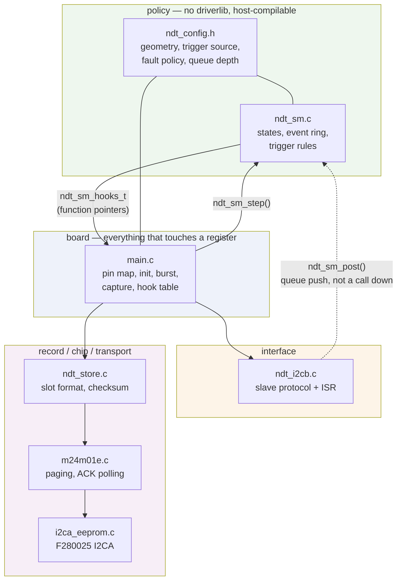

The only upward edge is `ndt_sm_post()`, and it is a ring-buffer push rather than a
call into board code — which is what keeps `ndt_sm.c` free of driverlib.

---

## 1. Boot — `main()` composition root

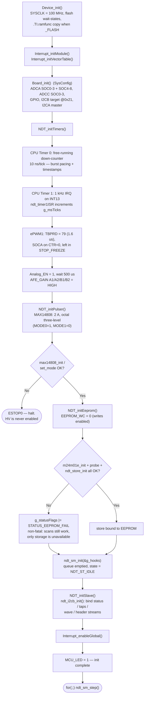

**Ordering constraint:** `ndt_sm_init()` and `ndt_i2cb_init()` must both run *before*
`Interrupt_enableGlobal()`. The I2CB ISR is a producer on the state machine's event
ring, so the ring has to be empty and the hook table bound before the first interrupt
can fire.

---

## 2. Main loop — the state machine

States are `ndt_state_t` in `ndt_sm.h`. The state variable lives inside `ndt_sm.c`
and is written by exactly one context: whoever calls `ndt_sm_step()`. No ISR touches it.

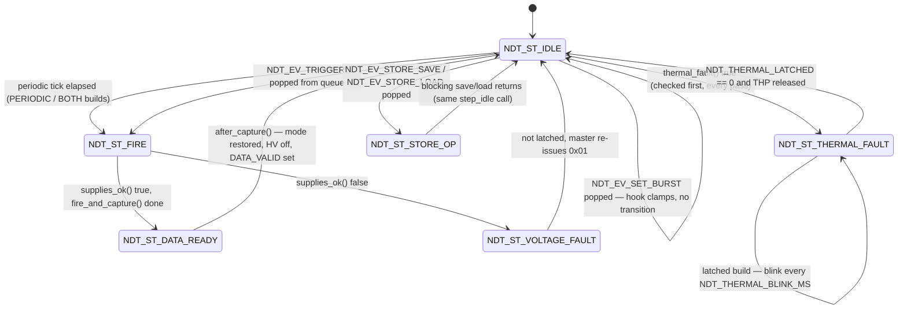

Two things worth reading carefully:

- `NDT_ST_STORE_OP` is entered and left **inside a single `step_idle()` call**, around
  the blocking `store_save()` / `store_load()` hook. It is not a state the loop parks
  in, so the `case NDT_ST_STORE_OP` arm in `ndt_sm_step()` is unreachable in the
  current design — it exists as a safety default.
- `NDT_ST_VOLTAGE_FAULT` costs one extra `ndt_sm_step()` pass before returning to
  idle. That pass is where a master polling `STATUS` can observe the state.

---

## 3. `step_idle()` — priority order in the idle state

This is the part the old diagram got wrong: commands are **queued**, not applied by
the ISR, and they are consumed only here.

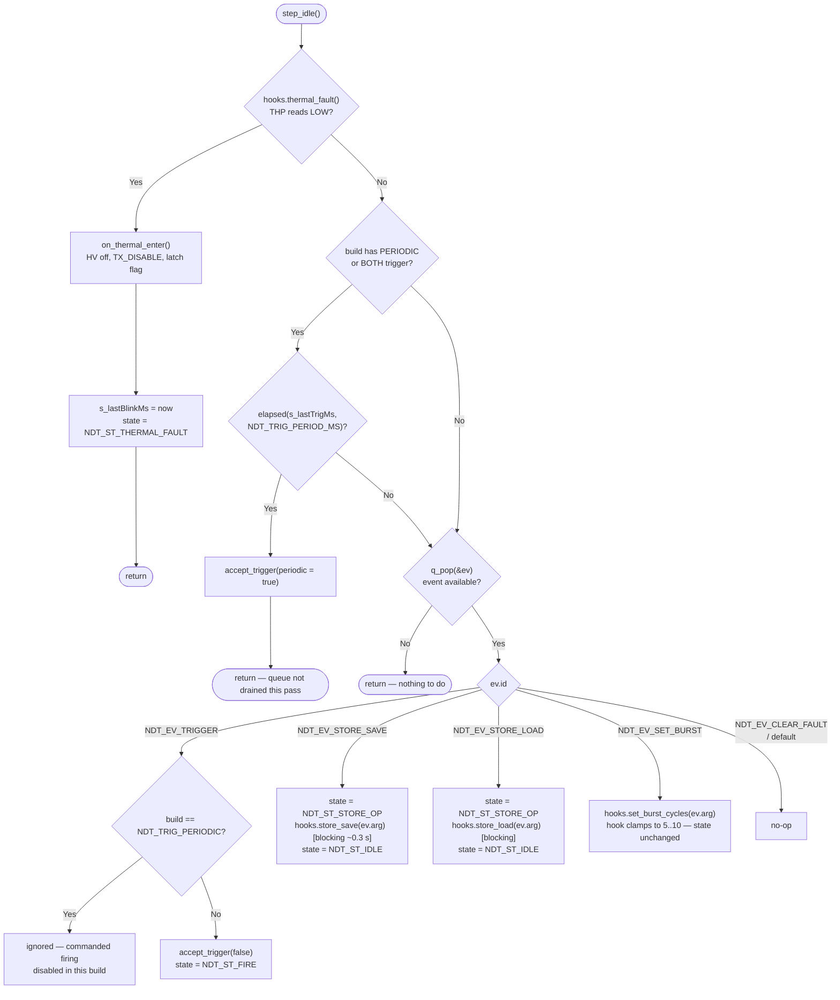

**One event per pass.** `step_idle()` pops at most one event, so a burst of eight
commands takes eight loop iterations to drain — negligible, since a pass with nothing
to do is a handful of instructions.

**Periodic pre-emption.** In a `PERIODIC` or `BOTH` build the periodic branch returns
early, so a tick that is due delays the queue drain by one pass. Only pathological if
`NDT_TRIG_PERIOD_MS` approaches the loop period.

---

## 4. Event queue — single-producer / single-consumer ring

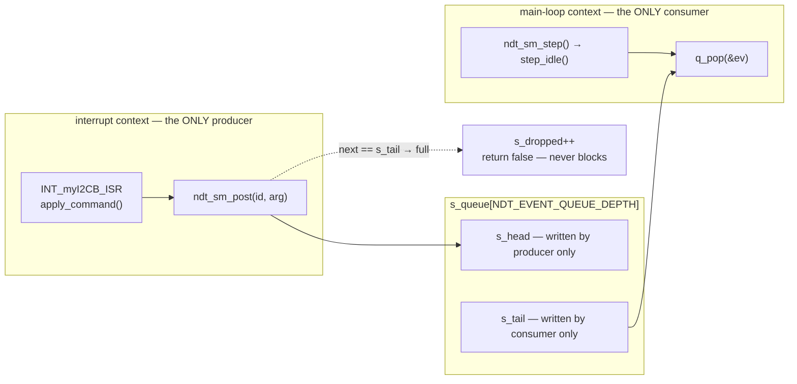

Each index is written by exactly one context and only read by the other, so neither
side needs a critical section. That invariant is why the **thermal check and the
periodic tick are handled inline in `step_idle()` rather than posted as events** — a
second producer would break the lock-free guarantee.

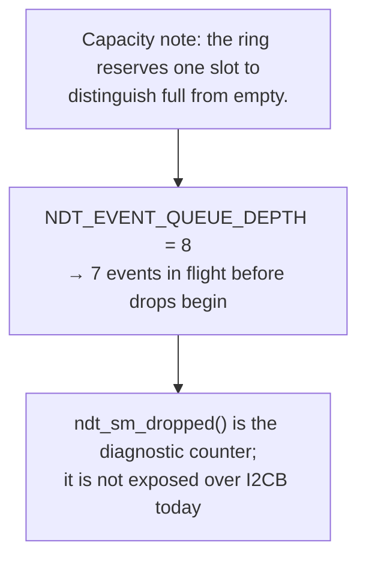

---

## 5. `NDT_ST_FIRE` → capture path

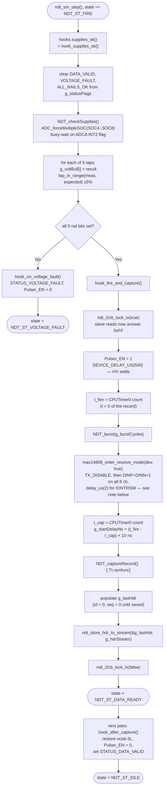

> **Discrepancy flagged during review.** `README.md` and the previous version of this
> file both describe a *"~12 µs"* T/R dead time. `max14808_enter_receive_mode()` in
> `max14808.c` actually waits **2 µs** (`tONTRSW` max 1.2 µs plus guard). The eight
> `_write_channel()` calls add only tens of cycles. Either the code or the README is
> wrong; the diagram above follows the code. This also moves the expected
> `start_delay_ns` for a 5-cycle burst from ≈45 µs to ≈35 µs — worth confirming on the
> bench before the number is used as an acceptance limit.

### 5a. `NDT_burst()` — drift-free bipolar excitation

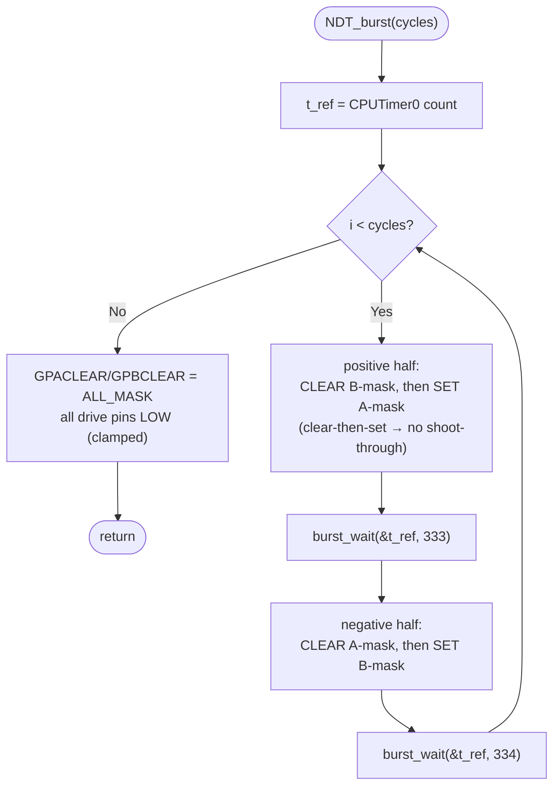

`burst_wait()` advances `*t_ref` by exactly the requested tick count rather than
re-reading the timer, so loop-overhead jitter cannot accumulate across the burst.
Alternating 333/334 SYSCLK half-periods give a 667-tick cycle → 149.925 kHz (−0.05 %).

### 5b. `NDT_captureRecord()` — RAM-resident polling loop

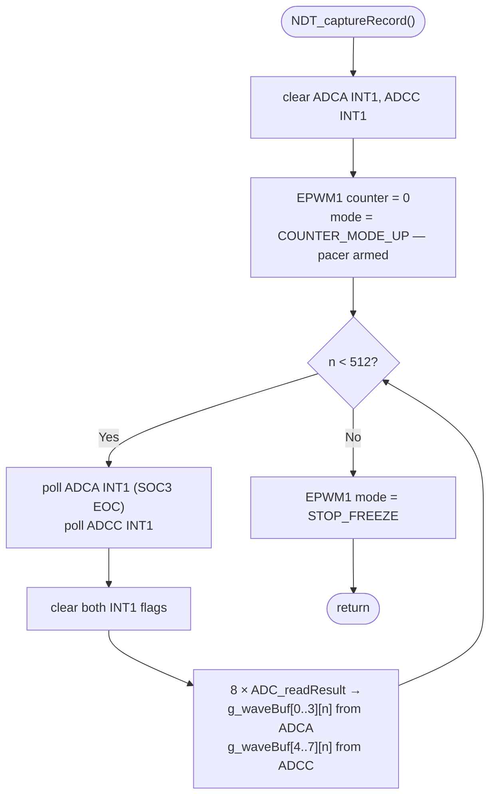

Budget: SOCA every 1.6 µs = 160 SYSCLK cycles per sweep; the 4-SOC round robin takes
≈1.45 µs, leaving the store body the remainder. Requires `-O2` **and** the RAM
placement — flash wait-states alone would push it over.

---

## 6. I2CB slave ISR — command and stream dispatch

The ISR does three things: accumulate parameter bytes, retarget the TX descriptor, or
push one event. It never changes state, never clamps, never touches the EEPROM.

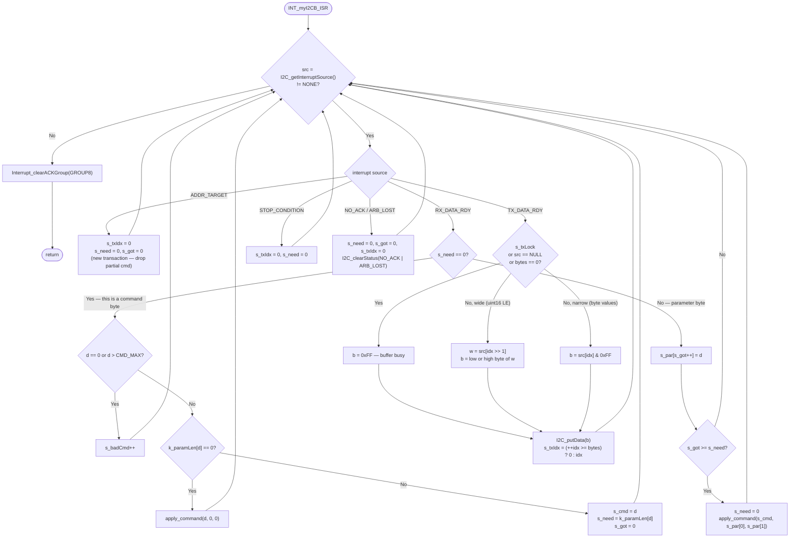

### 6a. `apply_command()` — two kinds of command

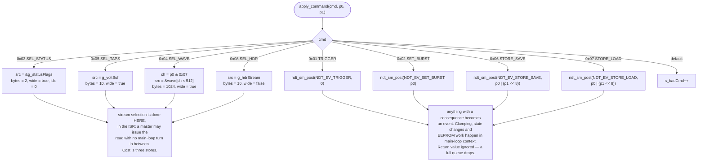

**Behaviour change from the pre-refactor firmware:** `0x01`, `0x06` and `0x07` used to
be ignored outright unless the board was idle. They are now queued (7 deep in flight)
and executed when the board next reaches idle. They are lost only on queue overflow.

---

## 7. EEPROM record store

### 7a. Save — `hook_store_save()` → `ndt_store_save()`

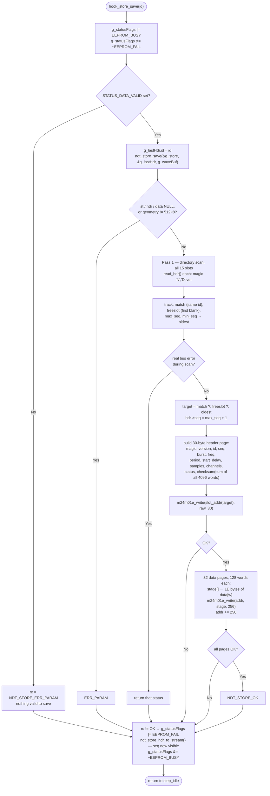

Slot selection is **overwrite-same-id → first-free → evict-lowest-seq**. Sequence
numbers are assigned by the store, not the caller, and are written back into the
caller's header so `P-HDR` reflects the committed value.

### 7b. Load — `hook_store_load()` → `ndt_store_load()`

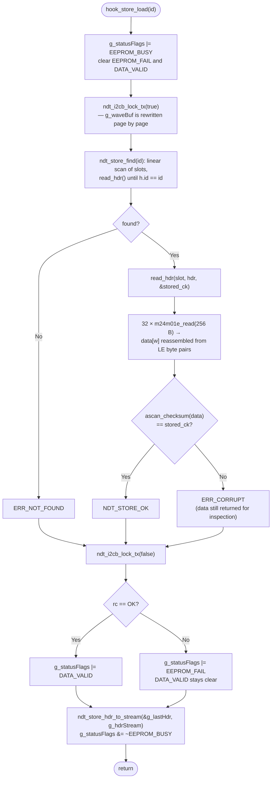

A corrupt record is never reported to the master as valid: `DATA_VALID` stays clear
and `EEPROM_FAIL` is set.

---

## 8. TX lock — why a read can never tear

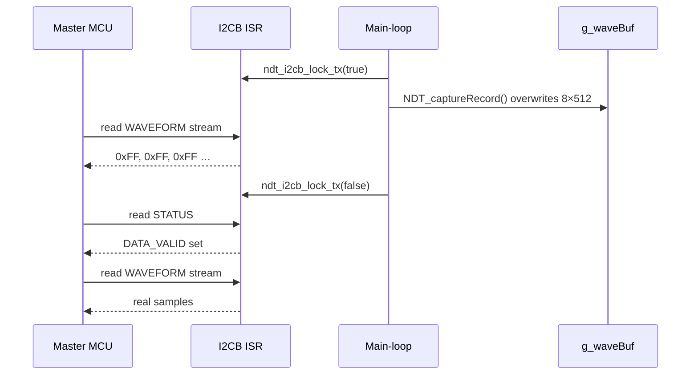

Cheaper than double-buffering, which would cost another 8 KB of the 24 KB SRAM. The
lock is set for the whole of `hook_fire_and_capture()` and for the data phase of
`hook_store_load()`.

---

## 9. Reference tables

### 9a. I2CB command set (target address 0x21)

| Write bytes | Effect | Path | Read-back |
|---|---|---|---|
| `0x01` | Trigger A-scan | posts `NDT_EV_TRIGGER` | — |
| `0x02 [n]` | Set burst cycles | posts `NDT_EV_SET_BURST`, hook clamps 5–10 | — |
| `0x03` | Select STATUS | TX descriptor, in ISR | 2 B (LE) |
| `0x04 [ch]` | Select WAVEFORM, ch = `p0 & 7` | TX descriptor, in ISR | 1024 B (512 × u16 LE) |
| `0x05` | Select TAPS | TX descriptor, in ISR | 10 B (5 × u16 LE) |
| `0x06 [idL][idH]` | Save record under ID | posts `NDT_EV_STORE_SAVE` | — |
| `0x07 [idL][idH]` | Load record by ID | posts `NDT_EV_STORE_LOAD` | — |
| `0x08` | Select HEADER | TX descriptor, in ISR | 16 B |

Header stream (16 B, LE): `id(2) seq(4) burst_cycles(2) samples_per_ch(2) sample_period_ns(2) start_delay_ns(4)`.

### 9b. Status word

| Bit | Flag | Set by | Cleared by |
|---|---|---|---|
| 0x0001–0x0010 | rail `*_OK` bits | `hook_supplies_ok()` | start of each `supplies_ok()` |
| 0x0020 | `DATA_VALID` | `hook_after_capture()`, successful load | `supplies_ok()`, start of load |
| 0x0040 | `THERMAL_FAULT` | `hook_on_thermal_enter()` | reset only (latched build) |
| 0x0080 | `VOLTAGE_FAULT` | `hook_on_voltage_fault()` | start of next `supplies_ok()` |
| 0x0100 | `EEPROM_BUSY` | entry to save/load hook | exit of save/load hook |
| 0x0200 | `EEPROM_FAIL` | boot probe failure, failed op | start of each save/load |

### 9c. Where policy lives

| Decision | Symbol (`ndt_config.h`) | Consumed in |
|---|---|---|
| Record geometry | `NDT_ASCAN_SAMPLES`, `_CHANNELS` | `ndt_store.h` (compile-time check), `main.c` |
| Burst clamp | `NDT_BURST_CYCLES_MIN/MAX/DEFAULT` | `hook_set_burst_cycles()` |
| Trigger source | `NDT_TRIGGER_SOURCE` | `step_idle()` (`#if`) |
| Periodic period / catch-up | `NDT_TRIG_PERIOD_MS`, `NDT_TRIG_SKIP_MISSED` | `step_idle()`, `accept_trigger()` |
| Thermal latch / blink | `NDT_THERMAL_LATCHED`, `NDT_THERMAL_BLINK_MS` | `ndt_sm_step()` |
| Queue depth | `NDT_EVENT_QUEUE_DEPTH` | `ndt_sm.c` ring |

Switching from commanded to periodic firing is a `ndt_config.h` edit and a rebuild:
an I2CB command and a timer tick post the same `NDT_EV_TRIGGER`, and the state machine
cannot tell them apart.
